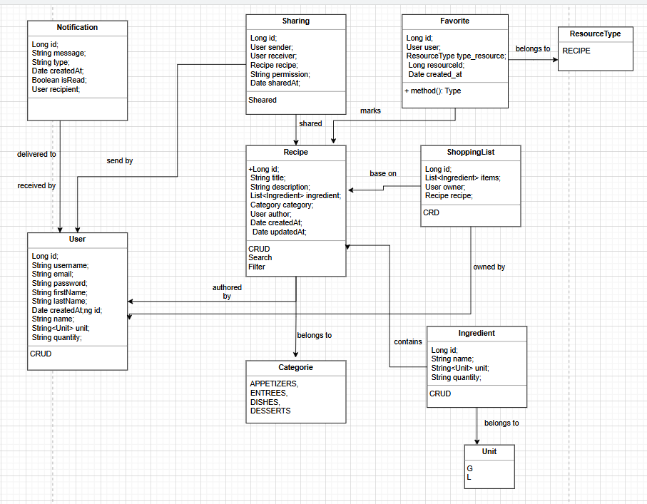

# recipe-management

## Liste de fonctionnalités initiale

- Créer une recette
- Modifier une recette
- Supprimer une recette
- Voir une recette
- Rechercher une recette
- Filtrer les recettes par catégories
- Mettre une recette en favori
- Générer une liste de course à partir d'une recette
- Voir la liste de course
- Supprimer la liste de course
- Ajouter des ingrédients
- Modifier des ingrédients
- Supprimer des ingrédients
- Voir des ingrédients
- Authentification utilisateur
- créer un compte
- Supprimer un compte
- se connecter
- se déconnecter
- Modifier son profil utilisateur
- Partage de recettes entre utilisateurs
- voir les recettes partagées
- Notifications de nouvelles recettes
- Notifications de partage

## Étape 1 — Regrouper par domaines métier

|Module        | Fonctionnalités incluses                     |
|---------------|---------------------------------------------|
| Recipe        | Créer, modifier, supprimer, filtrer, voir, rechercher, filtrer par catégories |
| Ingredients   | Ajouter, modifier, supprimer, voir |
| ShoppingList  | Générer depuis recette, supprimer, voir            |
| User          | Authentification, créer un compte, se connecter, se déconnecter, modifier profil, supprimer compte |
| Sharing       | Partage recettes, voir les recettes partagées    |
| Notification  | Nouvelle recette, Notification de partage                           |
| Favorite | Ajouter, Supprimer |


### Modules identifiés

- Recipe Module
- ShoppingList Module
- User Module
- Sharing Module
- Notification Module
- Favorite Module
- Ingredient Module

## Étape 2 — Identifier les entités métier

- Recipe
- ShoppingList
- User
- Sharing
- Notification
- Favorite
- Ingredient

```
class Recipe {
      Long id;
      String title;
      String description;
      List<Ingredient> ingredient;
      Category category;
      User author;
      Date createdAt;
      Date updatedAt;
}

enum Category {
      APPETIZERS,
      ENTREES,
      DISHES,
      DESSERTS
}

class Ingredient {
      Long id;
      String name;
      Unit unit;
      String quantity;
}

enum Unit {
      G,
      L
}

class ShoppingList {
      Long id;
      List<Ingredient> items;
      User owner;
      Recipe recipe;
}

class User {
    Long id;
    String username;
    String email;
    String password;
    String firstName;
    String lastName;
    Date createdAt;
}

class Sharing {
    Long id;
    User sender;
    User receiver;
    Recipe recipe;
    String permission;
    Date sharedAt;
}

class Notification {
    Long id;
    String message;
    String type;
    Date createdAt;
    Boolean isRead;
    User recipient;
}

class Favorite {
    Long id;
    User user;
    ResourceType type_resource;
    Long resourceId;
    Date created_at
}

enum ResourceType {
    RECIPE
}
```

### Diagramme de classe



### Étape 3 — Dériver les composants techniques

Pour les fonctionnalités critiques de l’application on identifie les principales couches techniques nécessaires:

| Fonctionnalité | Interface d’entrée | Logique métier | Persistance |
|---|---|---|---|
| **Créer une recette** | Recevoir la demande de création d’une recette | Vérifier le titre, la catégorie et les ingrédients | Enregistrer la recette en base |
| **Modifier une recette** | Recevoir la demande de modification d’une recette | Vérifier que la recette existe et valider les nouvelles données | Mettre à jour la recette en base |
| **Supprimer une recette** | Recevoir la demande de suppression d’une recette | Vérifier que la recette existe et que la suppression est autorisée | Supprimer la recette de la base |
| **Voir une recette** | Recevoir la demande d’affichage d’une recette | Vérifier que la recette demandée existe | Récupérer la recette depuis la base |
| **Rechercher une recette** | Recevoir la demande de recherche de recette | Interpréter le mot-clé de recherche | Récupérer les recettes correspondantes en base |
| **Générer une liste de course** | Recevoir la demande de génération d’une liste | Récupérer les ingrédients de la recette et construire la liste | Enregistrer la liste de course en base |
| **Créer un compte** | Recevoir les informations d’inscription | Vérifier la validité des données et l’unicité de l’email | Enregistrer le nouvel utilisateur en base |
| **Se connecter** | Recevoir les identifiants de connexion | Vérifier l’email et le mot de passe | Récupérer les informations utilisateur en base |
| **Partager une recette** | Recevoir la demande de partage d’une recette | Vérifier la recette, l’expéditeur et le destinataire | Enregistrer le partage en base |

### Étape 4 - Étape 4 — Les fonctionnalités orientent les patterns

Les fonctionnalités de notification de notre application nécessitent d'utiliser le Pattern Observer. Ce pattern est spécifique à l'envoi de notifications, en écoutant les évenements et en déclenchant la méthode de notification sur l'objet concerné.


