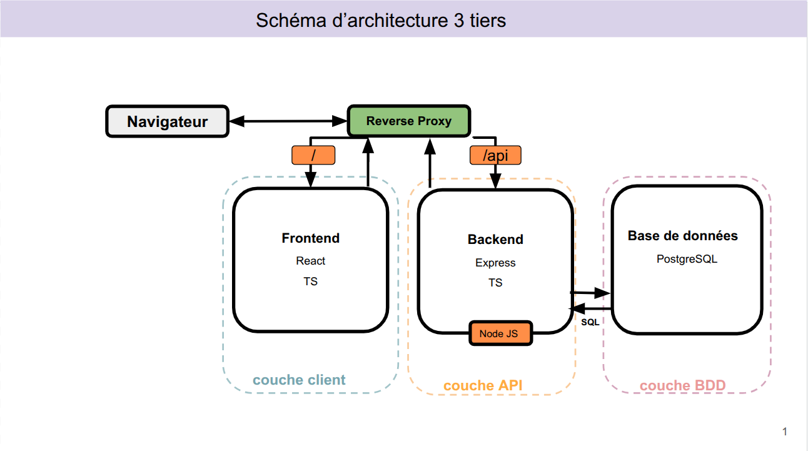
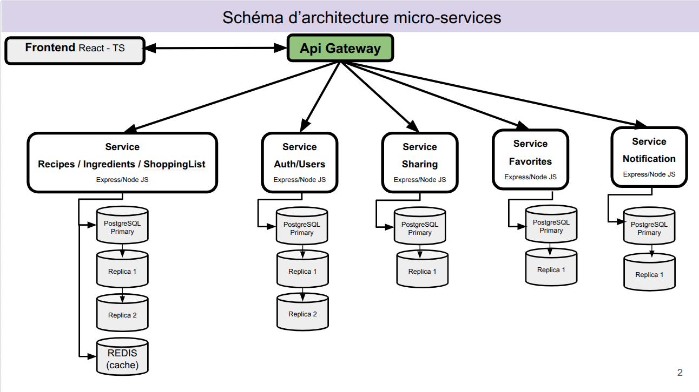

# recipe-management

## Liste de fonctionnalités initiale

- Créer une recette
- Modifier une recette
- Supprimer une recette
- Voir une recette
- Rechercher une recette
- Filtrer les recettes par catégories
- Mettre une recette en favori
- Générer une liste de course à partir d'une recette
- Voir la liste de course
- Supprimer la liste de course
- Ajouter des ingrédients
- Modifier des ingrédients
- Supprimer des ingrédients
- Voir des ingrédients
- Authentification utilisateur
- créer un compte
- Supprimer un compte
- se connecter
- se déconnecter
- Modifier son profil utilisateur
- Partage de recettes entre utilisateurs
- voir les recettes partagées
- Notifications de nouvelles recettes
- Notifications de partage

## Étape 1 — Regrouper par domaines métier

|Module        | Fonctionnalités incluses                     |
|---------------|---------------------------------------------|
| Recipe        | Créer, modifier, supprimer, filtrer, voir, rechercher, filtrer par catégories |
| Ingredients   | Ajouter, modifier, supprimer, voir |
| ShoppingList  | Générer depuis recette, supprimer, voir            |
| User          | Authentification, créer un compte, se connecter, se déconnecter, modifier profil, supprimer compte |
| Sharing       | Partage recettes, voir les recettes partagées    |
| Notification  | Nouvelle recette, Notification de partage                           |
| Favorite | Ajouter, Supprimer |


### Modules identifiés

- Recipe Module
- ShoppingList Module
- User Module
- Sharing Module
- Notification Module
- Favorite Module
- Ingredient Module

## Étape 2 — Identifier les entités métier

- Recipe
- ShoppingList
- User
- Sharing
- Notification
- Favorite
- Ingredient

```
class Recipe {
      Long id;
      String title;
      String description;
      List<Ingredient> ingredient;
      Category category;
      User author;
      Date createdAt;
      Date updatedAt;
}

enum Category {
      APPETIZERS,
      ENTREES,
      DISHES,
      DESSERTS
}

class Ingredient {
      Long id;
      String name;
      Unit unit;
      String quantity;
}

enum Unit {
      G,
      L
}

class ShoppingList {
      Long id;
      List<Ingredient> items;
      User owner;
      Recipe recipe;
}

class User {
    Long id;
    String username;
    String email;
    String password;
    String firstName;
    String lastName;
    Date createdAt;
}

class Sharing {
    Long id;
    User sender;
    User receiver;
    Recipe recipe;
    String permission;
    Date sharedAt;
}

class Notification {
    Long id;
    String message;
    String type;
    Date createdAt;
    Boolean isRead;
    User recipient;
}

class Favorite {
    Long id;
    User user;
    ResourceType type_resource;
    Long resourceId;
    Date created_at
}

enum ResourceType {
    RECIPE
}
```

### Diagramme de classe


## Étape 3 — Dériver les composants techniques

Pour les fonctionnalités critiques de l’application on identifie les principales couches techniques nécessaires:

| Fonctionnalité | Interface d’entrée | Logique métier | Persistance |
|---|---|---|---|
| **Créer une recette** | Recevoir la demande de création d’une recette | Vérifier le titre, la catégorie et les ingrédients | Enregistrer la recette en base |
| **Modifier une recette** | Recevoir la demande de modification d’une recette | Vérifier que la recette existe et valider les nouvelles données | Mettre à jour la recette en base |
| **Supprimer une recette** | Recevoir la demande de suppression d’une recette | Vérifier que la recette existe et que la suppression est autorisée | Supprimer la recette de la base |
| **Voir une recette** | Recevoir la demande d’affichage d’une recette | Vérifier que la recette demandée existe | Récupérer la recette depuis la base |
| **Rechercher une recette** | Recevoir la demande de recherche de recette | Interpréter le mot-clé de recherche | Récupérer les recettes correspondantes en base |
| **Générer une liste de course** | Recevoir la demande de génération d’une liste | Récupérer les ingrédients de la recette et construire la liste | Enregistrer la liste de course en base |
| **Créer un compte** | Recevoir les informations d’inscription | Vérifier la validité des données et l’unicité de l’email | Enregistrer le nouvel utilisateur en base |
| **Se connecter** | Recevoir les identifiants de connexion | Vérifier l’email et le mot de passe | Récupérer les informations utilisateur en base |
| **Partager une recette** | Recevoir la demande de partage d’une recette | Vérifier la recette, l’expéditeur et le destinataire | Enregistrer le partage en base |

## Étape 4 - Étape 4 — Les fonctionnalités orientent les patterns

Les fonctionnalités de notification de notre application nécessitent d'utiliser le Pattern Observer. Ce pattern est spécifique à l'envoi de notifications, en écoutant les évenements et en déclenchant la méthode de notification sur l'objet concerné.


## Etape 5 - Schémas de base de données

## Etape 6 - Architecture 

### Architecture Générale en 3 tiers 
Le schéma ci-dessous représente l'architure générale de notre application découpée en 3 couches. Cette architecture est retenue pour la V1 de notre application afin d'avoir une version rapidement fonctionnelle, réalisée par une petite équipe de développeurs. Un reverse proxy se charge d'orienter les requêtes vers le frontend React ou le backend Express/NodeJS. La persistance des données est assurée par une base de données relationnelle POstgreSQL.



### Architecture Générale en micro-services
Le schéma ci-dessous représente l'architecture générale de notre application découpée en micro-services. Nous projetons d'intégrer cette architecture lors de la V2 de notre application afin de garantir une plus grande maintenabilité. L'architecture est découpée par domaine métier. Le frontend React communique avec les services par le biais d'une API Gateway qui permet de rediriger les requêtes vers les différents services. Chaque service utilise une base de données PostgreSQL avec un ou plusieurs réplicas afin de garantir la disponibilité des données. Un cache est mis en place avec Redis afin d'améliorer les performances du service principal. Dans ce service principal nous avons fait le choix de regrouper recipes, ingredients et shopping list car la liste de course dépend directement des ingrédients de la recette et doit être mise à jour dès qu'une recette est modifiée. 



### ADR
#### ADR 001 : Choix de l'architecture 3-tiers pour la V1

Statut : Terminé

Contexte : Pour le lancement de l'application, nous devons fournir un produit minimum viable (MVP) rapidement. L'équipe est restreinte et nous avons besoin d'une structure simple à déployer et à tester.

Décision : Nous avons opté pour une architecture 3-tiers classique :

Frontend : React (TypeScript).

Backend : Node.js avec Express (TypeScript).

Base de données : PostgreSQL unique.

Routage : Un Reverse Proxy gère l'aiguillage entre le web et l'API.

Conséquences
Avantages : Développement rapide, déploiement simplifié, cohérence des données facilitée par une base unique, coûts d'infrastructure réduits.

Inconvénients : Difficile à passer à l'échelle (scalabilité verticale uniquement), risque de "code spaghetti" si le backend grossit trop, point de défaillance unique (la BDD).

## ADR 002 : Transition vers une architecture micro-services pour la V2

Statut : Proposé / En cours

Contexte : Avec la croissance de l'application, la maintenance du monolithe V1 devient complexe. Nous devons améliorer la disponibilité, permettre des déploiements indépendants par domaine métier et optimiser les performances.

Décision : Migration vers une architecture micro-services structurée par domaines :

API Gateway : Point d'entrée unique pour le Frontend.

Découpage métier : Création de services indépendants (Auth, Sharing, Favorites, Notifications).

Service "Core" (Recipes/Ingredients/ShoppingList) : Ces trois entités sont regroupées dans un seul service pour garantir l'intégrité transactionnelle "une modification de recette impacte directement la liste de course".

Haute disponibilité : Utilisation de réplicas PostgreSQL pour chaque service.

Performance : Implémentation de Redis pour le cache du service principal.

Conséquences
Avantages : Scalabilité granulaire "on booste uniquement le service de recettes", meilleure isolation des pannes, maintenabilité accrue par domaine.

Inconvénients : Complexité opérationnelle , gestion de la cohérence éventuelle entre services, coût d'infrastructure plus élevé.

## ADR 003 : Choix de PostgreSQL comme système de gestion de base de données

Statut : Accepté

Contexte: Pour notre application de gestion de recettes et de listes de courses, nous avons besoin d'un stockage persistant. Le choix se porte sur la structure des données et sur les garanties de fiabilité des transactions.

Alternatives envisagées
NoSQL (ex: MongoDB, Cassandra) : Offrent une grande flexibilité de schéma et une scalabilité horizontale facilitée.

SGBD Relationnel (PostgreSQL) : Offre une structure rigoureuse et des garanties transactionnelles fortes.

Justification du choix : ACID vs BASE
L'application manipule des données critiques (comptes utilisateurs, partages de recettes, permissions). Nous privilégions le modèle ACID (Atomicité, Cohérence, Isolation, Durabilité) de PostgreSQL :

Atomicité : Si la création d'une recette échoue à mi-chemin, rien n'est enregistré.

Cohérence : Les règles métier (ex: une ShoppingList doit être liée à un User existant) sont garanties par des clés étrangères.

Les bases NoSQL suivent souvent le modèle BASE (Basically Available, Soft state, Eventual consistency), où la cohérence n'est pas immédiate, ce qui poserait problème pour la gestion des permissions de partage.

Analyse via le Théorème CAP
Le théorème CAP stipule qu'un système distribué ne peut garantir que deux des trois propriétés suivantes : Cohérence, Availability (Disponibilité), Partition Tolerance (Tolérance au fractionnement).

Choix de PostgreSQL : Se situe dans la catégorie CP (ou CA sur un seul nœud). En cas de conflit, nous privilégions la Cohérence  plutôt que la disponibilité absolue (réponse potentiellement erronée).

Alternative NoSQL : Beaucoup sont de type AP (Disponibilité et Tolérance). Pour une application sociale de recettes, voir une recette avec 2 secondes de retard est acceptable, mais avoir une liste de courses désynchronisée ou une faille de permission est critique.

Décision : Nous retenons PostgreSQL pour sa maturité, sa gestion native du JSON (permettant une certaine flexibilité NoSQL si besoin) et sa conformité stricte aux propriétés ACID.

Conséquences
Positives : Intégrité des données garantie, jointures complexes performantes (ex: filtrer les favoris par catégorie), écosystème d'outils d'audit robuste.

Négatives : Schéma plus rigide nécessitant des migrations de base de données (scripts SQL) à chaque évolution, montée en charge horizontale plus complexe qu'avec du NoSQL (nécessite les réplicas vus en V2).


